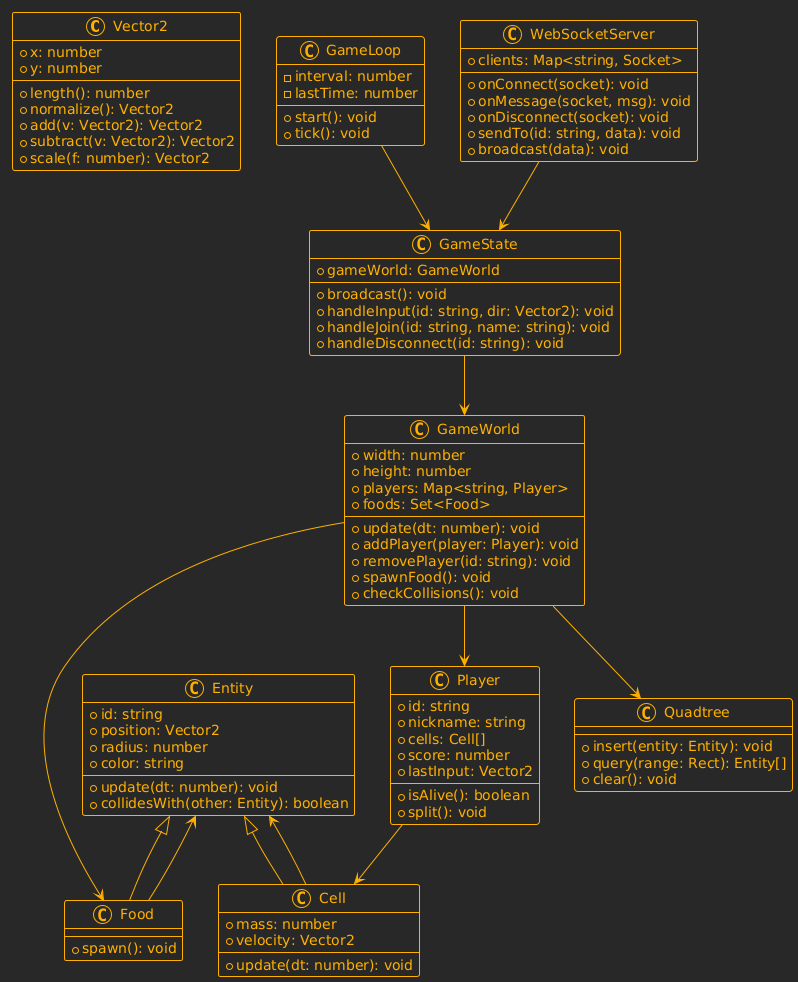

# Agar.io Clone Implementation Guide

This project is an initial implementation of an Agar.io clone with WebSocket communication between the frontend and backend. The game features a player controlled by the client and a bot player that moves randomly around the map.

## Project Structure

```
├── server.js         # Backend WebSocket server and game logic
├── index.html        # Landing page (already provided)
├── game.html         # Game canvas and UI
├── styles.css        # Styles for both pages
└── package.json      # Node.js project configuration
```

## Setting Up the Project

1. Install dependencies:

   ```
   npm install
   ```

2. Start the server:

   ```
   npm start
   ```

3. Open your browser and navigate to the landing page. You can use any local server to serve the HTML files, such as:
   ```
   npx serve .
   ```

## Implementation Details

### Backend (server.js)

The server implements:

- WebSocket communication using the 'ws' library
- Game classes following the provided class diagram:
  - Vector2: Vector math utility
  - Entity: Base class for all game objects
  - Food: Food pellets that players can eat
  - Cell: Player cells
  - Player: Container for cells belonging to a player
  - GameWorld: Game environment containing players and food
  - GameState: Manages game state and handles events
  - GameLoop: Controls the game update loop

The server handles the following message types:

- `join`: When a player connects and provides their nickname
- `input`: When a player sends movement input
- `leave`: When a player disconnects

### Frontend (game.html)

The game client:

- Connects to the WebSocket server
- Sends player actions (join, input)
- Receives game state updates
- Renders the game world on an HTML canvas
- Handles player input (mouse movement)
- Manages the camera to follow the player
- Updates the UI with score and leaderboard information

### Communication Protocol

As specified in the sequence diagram, the communication follows this pattern:

1. Player Joins:

   - Client → Server: `join { id, nickname }`
   - Server → Client: `playerData { id, nickname, bestScore }`

2. Game Loop:

   - Client → Server: `input { direction }`
   - Server → Client: `state { players, foods }`

3. Player Dies (to be implemented in future):

   - Server → Client: `death { youDied: true, killerId }`

4. Leaderboard (to be implemented in future):
   - Client → Server: `scoreRequest { id }`
   - Server → Client: `leaderboard + yourScore`

## Diagrams



