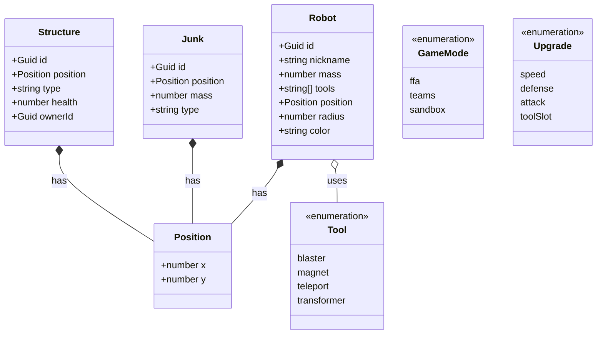

```mermaid
classDiagram
    class Position {
        +number x
        +number y
    }

    class Robot {
        +Guid id
        +string nickname
        +number mass
        +string[] tools
        +Position position
        +number radius
        +string color
    }

    class Junk {
        +Guid id
        +Position position
        +number mass
        +string type
    }

    class Structure {
        +Guid id
        +Position position
        +string type
        +number health
        +Guid ownerId
    }

    class Tool {
        <<enumeration>>
        blaster
        magnet
        teleport
        transformer
    }

    class GameMode {
        <<enumeration>>
        ffa
        teams
        sandbox
    }

    class Upgrade {
        <<enumeration>>
        speed
        defense
        attack
        toolSlot
    }

    Robot *-- Position : has
    Junk *-- Position : has
    Structure *-- Position : has
    Robot o-- Tool : uses
```
