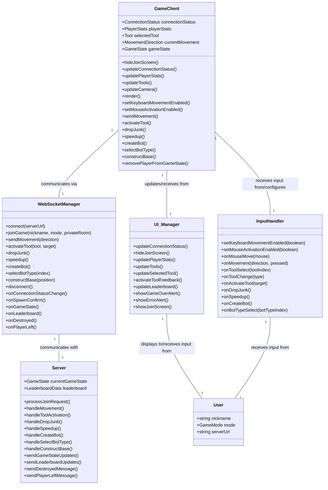

```mermaid
classDiagram
    class User {
        +string nickname
        +GameMode mode
        +string serverUrl
    }

    class GameClient {
        +ConnectionStatus connectionStatus
        +PlayerStats playerStats
        +Tool selectedTool
        +MovementDirection currentMovement
        +GameState gameState
        +hideJoinScreen()
        +updateConnectionStatus()
        +updatePlayerStats()
        +updateTools()
        +updateCamera()
        +render()
        +setKeyboardMovementEnabled()
        +setMouseActivationEnabled()
        +sendMovement()
        +activateTool()
        +dropJunk()
        +speedup()
        +createBot()
        +selectBotType()
        +constructBase()
        +removePlayerFromGameState()
    }

    class WebSocketManager {
        +connect(serverUrl)
        +joinGame(nickname, mode, privateRoom)
        +sendMovement(direction)
        +activateTool(tool, target)
        +dropJunk()
        +speedup()
        +createBot()
        +selectBotType(index)
        +constructBase(position)
        +disconnect()
        +onConnectionStatusChange()
        +onSpawnConfirm()
        +onGameState()
        +onLeaderboard()
        +onDestroyed()
        +onPlayerLeft()
    }

    class Server {
        +GameState currentGameState
        +LeaderboardData leaderboard
        +processJoinRequest()
        +handleMovement()
        +handleToolActivation()
        +handleDropJunk()
        +handleSpeedup()
        +handleCreateBot()
        +handleSelectBotType()
        +handleConstructBase()
        +sendGameStateUpdates()
        +sendLeaderboardUpdates()
        +sendDestroyedMessage()
        +sendPlayerLeftMessage()
    }

    class UI_Manager {
        +updateConnectionStatus()
        +hideJoinScreen()
        +updatePlayerStats()
        +updateTools()
        +updateSelectedTool()
        +activateToolFeedback()
        +updateLeaderboard()
        +showGameOverAlert()
        +showErrorAlert()
        +showJoinScreen()
    }

    class InputHandler {
        +setKeyboardMovementEnabled(boolean)
        +setMouseActivationEnabled(boolean)
        +onMouseMove(mouse)
        +onMovement(direction, pressed)
        +onToolSelect(toolIndex)
        +onToolChange(type)
        +onActivateTool(target)
        +onDropJunk()
        +onSpeedup()
        +onCreateBot()
        +onBotTypeSelect(botTypeIndex)
    }

    GameClient "1" -- "1" WebSocketManager : communicates via
    GameClient "1" -- "1" UI_Manager : updates/receives from
    GameClient "1" -- "1" InputHandler : receives input from/configures
    WebSocketManager "1" -- "1" Server : communicates with
    UI_Manager "1" -- "1" User : displays to/receives input from
    InputHandler "1" -- "1" User : receives input from
```
