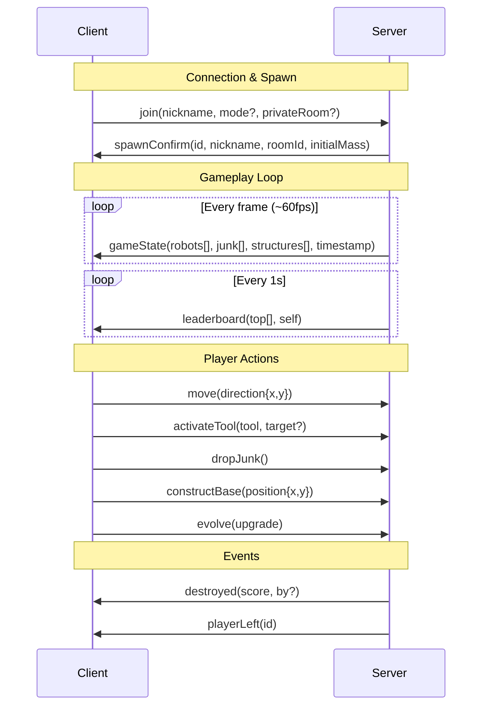

```mermaid
sequenceDiagram
    participant C as Client
    participant S as Server

    Note over C,S: Connection & Spawn
    C->>S: join(nickname, mode?, privateRoom?)
    S->>C: spawnConfirm(id, nickname, roomId, initialMass)

    Note over C,S: Gameplay Loop
    loop Every frame (~60fps)
        S->>C: gameState(robots[], junk[], structures[], timestamp)
    end

    loop Every 1s
        S->>C: leaderboard(top[], self)
    end

    Note over C,S: Player Actions
    C->>S: move(direction{x,y})
    C->>S: activateTool(tool, target?)
    C->>S: dropJunk()
    C->>S: constructBase(position{x,y})
    C->>S: evolve(upgrade)

    Note over C,S: Events
    S->>C: destroyed(score, by?)
    S->>C: playerLeft(id)
```
