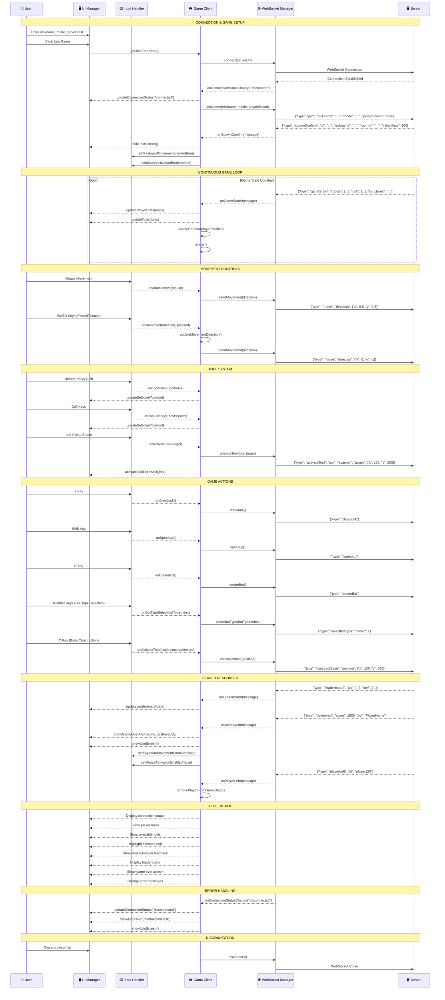

```mermaid
sequenceDiagram
    participant User as 👤 User
    participant UI as 🖥️ UI Manager
    participant Input as ⌨️ Input Handler
    participant Client as 🎮 Game Client
    participant WS as 🌐 WebSocket Manager
    participant Server as 🖥️ Server

    Note over User, Server: CONNECTION & GAME SETUP
    User->>UI: Enter nickname, mode, server URL
    User->>UI: Click Join Game
    UI->>Client: getJoinFormData()
    Client->>WS: connect(serverUrl)
    WS->>Server: WebSocket Connection
    Server-->>WS: Connection Established
    WS-->>Client: onConnectionStatusChange("connected")
    Client-->>UI: updateConnectionStatus("connected")

    Client->>WS: joinGame(nickname, mode, privateRoom)
    WS->>Server: {"type": "join", "nickname": "...", "mode": "...", "privateRoom": false}
    Server-->>WS: {"type": "spawnConfirm", "id": "...", "nickname": "...", "roomId": "...", "initialMass": 100}
    WS-->>Client: onSpawnConfirm(message)
    Client-->>UI: hideJoinScreen()
    Client->>Input: setKeyboardMovementEnabled(true)
    Client->>Input: setMouseActivationEnabled(true)

    Note over User, Server: CONTINUOUS GAME LOOP
    loop Game State Updates
        Server-->>WS: {"type": "gameState", "robots": [...], "junk": [...], "structures": [...]}
        WS-->>Client: onGameState(message)
        Client-->>UI: updatePlayerStats(mass)
        Client-->>UI: updateTools(tools)
        Client->>Client: updateCamera(playerPosition)
        Client->>Client: render()
    end

    Note over User, Server: MOVEMENT CONTROLS
    User->>Input: Mouse Movement
    Input-->>Client: onMouseMove(mouse)
    Client->>WS: sendMovement(direction)
    WS->>Server: {"type": "move", "direction": {"x": 0.5, "y": 0.3}}

    User->>Input: WASD Keys (Press/Release)
    Input-->>Client: onMovement(direction, pressed)
    Client->>Client: updateMovementDirection()
    Client->>WS: sendMovement(direction)
    WS->>Server: {"type": "move", "direction": {"x": 0, "y": -1}}

    Note over User, Server: TOOL SYSTEM
    User->>Input: Number Keys (1-9)
    Input-->>Client: onToolSelect(toolIndex)
    Client-->>UI: updateSelectedTool(tool)

    User->>Input: Q/E Keys
    Input-->>Client: onToolChange("next"/"prev")
    Client-->>UI: updateSelectedTool(tool)

    User->>Input: Left Click / Space
    Input-->>Client: onActivateTool(target)
    Client->>WS: activateTool(tool, target)
    WS->>Server: {"type": "activateTool", "tool": "scanner", "target": {"x": 100, "y": 200}}
    Client-->>UI: activateToolFeedback(tool)

    Note over User, Server: GAME ACTIONS
    User->>Input: X Key
    Input-->>Client: onDropJunk()
    Client->>WS: dropJunk()
    WS->>Server: {"type": "dropJunk"}

    User->>Input: Shift Key
    Input-->>Client: onSpeedup()
    Client->>WS: speedup()
    WS->>Server: {"type": "speedup"}

    User->>Input: B Key
    Input-->>Client: onCreateBot()
    Client->>WS: createBot()
    WS->>Server: {"type": "createBot"}

    User->>Input: Number Keys (Bot Type Selection)
    Input-->>Client: onBotTypeSelect(botTypeIndex)
    Client->>WS: selectBotType(botTypeIndex)
    WS->>Server: {"type": "selectBotType", "index": 2}

    User->>Input: C Key (Base Construction)
    Input-->>Client: onActivateTool() with construction tool
    Client->>WS: constructBase(position)
    WS->>Server: {"type": "constructBase", "position": {"x": 150, "y": 300}}

    Note over User, Server: SERVER RESPONSES
    Server-->>WS: {"type": "leaderboard", "top": [...], "self": {...}}
    WS-->>Client: onLeaderboard(message)
    Client-->>UI: updateLeaderboard(data)

    Server-->>WS: {"type": "destroyed", "score": 1500, "by": "PlayerName"}
    WS-->>Client: onDestroyed(message)
    Client-->>UI: showGameOverAlert(score, destroyedBy)
    Client-->>UI: showJoinScreen()
    Client->>Input: setKeyboardMovementEnabled(false)
    Client->>Input: setMouseActivationEnabled(false)

    Server-->>WS: {"type": "playerLeft", "id": "player123"}
    WS-->>Client: onPlayerLeft(message)
    Client->>Client: removePlayerFromGameState()

    Note over User, Server: UI FEEDBACK
    Client-->>UI: Display connection status
    Client-->>UI: Show player mass
    Client-->>UI: Show available tools
    Client-->>UI: Highlight selected tool
    Client-->>UI: Show tool activation feedback
    Client-->>UI: Display leaderboard
    Client-->>UI: Show game over screen
    Client-->>UI: Display error messages

    Note over User, Server: ERROR HANDLING
    WS-->>Client: onConnectionStatusChange("disconnected")
    Client-->>UI: updateConnectionStatus("disconnected")
    Client-->>UI: showErrorAlert("Connection lost")
    Client-->>UI: showJoinScreen()

    Note over User, Server: DISCONNECTION
    User->>UI: Close browser/tab
    Client->>WS: disconnect()
    WS->>Server: WebSocket Close
```
